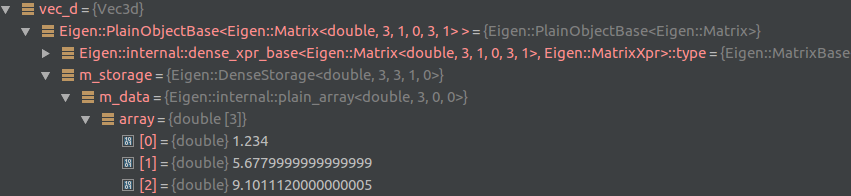
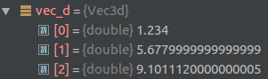
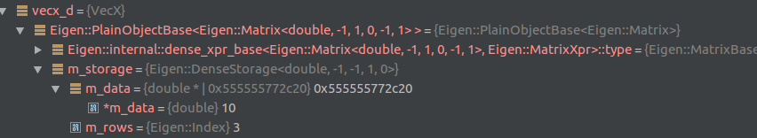
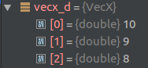
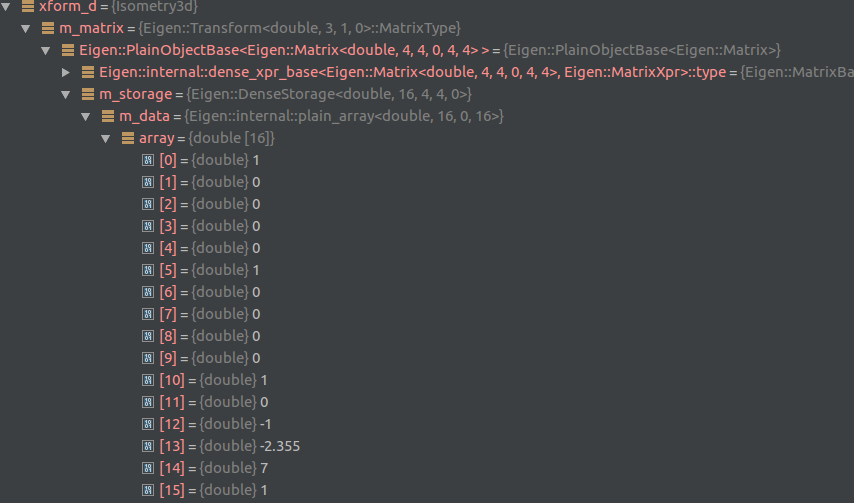
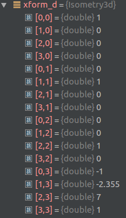
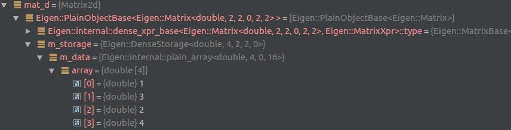
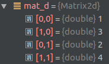
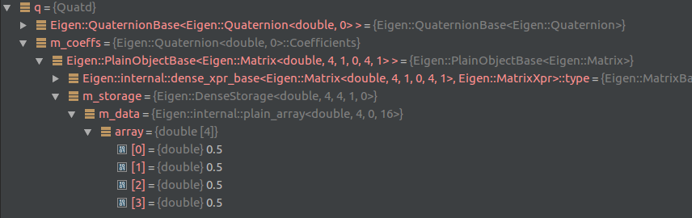
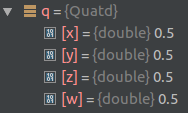

# GDB utilities for Drake

This project provides a number of debugging utilities for working with drake.

## Features

1. It can differentiate between being run in CLion and on the command line.
2. Provides convenient printouts of the "type safe" index types: `TypeSafeIndex` and `Identifier`.
  1. This assumes that they are used in the suggested method: e.g.,
  `using ThingId = Identifer<ThingTag>`. It will look for the ____Tag string to create display
   compact display name of the instantiated type.
3. Provides extended functionality for Eigen types beyond eigen's released functionality.
4. Handles `AutoDiff` types differently from `double` types.

## Install

1. Install the repository to some path: `$DRAKE_GDB_ROOT$` (such that this is the *full* 
path and not relative to your home directory).
2. Create (if it doesn't already exist) the file `~/.gdbinit`
3. Insert the following lines:
```
python
import sys, os
sys.path.insert(0, os.environ["DRAKE_GDB_ROOT"])
import drake_gdb 
drake_gdb.register_printers()
end
```

Simply launch gdb and the pretty printers will be instantiated. You should see
the following output in the GDB terminal:
```
Registered GDB printers for Drake
(gdb)
```

## Examples

Using the following small program:

```C++
#include <iostream>

#include "drake/common/eigen_types.h"

int main(int argc, char* argv[]) {
  using Vec3d = drake::Vector3<double>;
  using VecXd = drake::VectorX<double>;
  using Isometry3d = drake::Isometry3<double>;
  using Matrix2d = drake::Matrix2<double>;
  using Quatd = drake::Quaternion<double>;

  Vec3d vec_d;
  vec_d << 1.234, 5.678, 9.101112;
  VecXd vecx_d(3);
  vecx_d << 10, 9, 8;
  Isometry3d xform_d = Isometry3d::Identity();
  xform_d.translation() << -1, -2.355, 7;
  Matrix2d mat_d;
  mat_d << 1, 2, 3, 4;
  Quatd q_d(0.5, 0.5, 0.5, 0.5);
  return 0;
}
```

printing the values of `vec_d`, `vecx_d`, `xform_d`, `mat_d`, and `q_d`, respectively, *without*
`drake_gdb` looks like this in the command line:

```c++
$1 = {<Eigen::PlainObjectBase<Eigen::Matrix<double, 3, 1, 0, 3, 1> >> = {<Eigen::MatrixBase<Eigen::Matrix<d
ouble, 3, 1, 0, 3, 1> >> = {<Eigen::DenseBase<Eigen::Matrix<double, 3, 1, 0, 3, 1> >> = {<Eigen::DenseCoeff
sBase<Eigen::Matrix<double, 3, 1, 0, 3, 1>, 3>> = {<Eigen::DenseCoeffsBase<Eigen::Matrix<double, 3, 1, 0, 3
, 1>, 1>> = {<Eigen::DenseCoeffsBase<Eigen::Matrix<double, 3, 1, 0, 3, 1>, 0>> = {<Eigen::EigenBase<Eigen::
Matrix<double, 3, 1, 0, 3, 1> >> = {<No data fields>}, <No data fields>}, <No data fields>}, <No data field
s>}, <No data fields>}, <No data fields>}, m_storage = {m_data = {array = {1.234, 5.6779999999999999,      
     9.1011120000000005}}}}, <No data fields>}
$2 = {<Eigen::PlainObjectBase<Eigen::Matrix<double, -1, 1, 0, -1, 1> >> = {<Eigen::MatrixBase<Eigen::Matrix
<double, -1, 1, 0, -1, 1> >> = {<Eigen::DenseBase<Eigen::Matrix<double, -1, 1, 0, -1, 1> >> = {<Eigen::Dens
eCoeffsBase<Eigen::Matrix<double, -1, 1, 0, -1, 1>, 3>> = {<Eigen::DenseCoeffsBase<Eigen::Matrix<double, -1
, 1, 0, -1, 1>, 1>> = {<Eigen::DenseCoeffsBase<Eigen::Matrix<double, -1, 1, 0, -1, 1>, 0>> = {<Eigen::Eigen
Base<Eigen::Matrix<double, -1, 1, 0, -1, 1> >> = {<No data fields>}, <No data fields>}, <No data fields>}, 
<No data fields>}, <No data fields>}, <No data fields>}, m_storage = {m_data = 0x555555772c20, m_rows = 3}},
 <No data fields>}
$3 = {
  m_matrix = {<Eigen::PlainObjectBase<Eigen::Matrix<double, 4, 4, 0, 4, 4> >> = {<Eigen::MatrixBase<Eigen::M
atrix<double, 4, 4, 0, 4, 4> >> = {<Eigen::DenseBase<Eigen::Matrix<double, 4, 4, 0, 4, 4> >> = {<Eigen::Dens
eCoeffsBase<Eigen::Matrix<double, 4, 4, 0, 4, 4>, 3>> = {<Eigen::DenseCoeffsBase<Eigen::Matrix<double, 4, 4,
 0, 4, 4>, 1>> = {<Eigen::DenseCoeffsBase<Eigen::Matrix<double, 4, 4, 0, 4, 4>, 0>> = {<Eigen::EigenBase<Eig
en::Matrix<double, 4, 4, 0, 4, 4> >> = {<No data fields>}, <No data fields>}, <No data fields>}, <No data fi
elds>}, <No data fields>}, <No data fields>}, m_storage = {m_data = {array = {1, 0, 0, 0, 0, 1, 0, 0, 0, 0, 
1, 0, -1, -2.355, 7,             1}}}}, <No data fields>}}
$4 = {<Eigen::PlainObjectBase<Eigen::Matrix<double, 2, 2, 0, 2, 2> >> = {<Eigen::MatrixBase<Eigen::Matrix<do
uble, 2, 2, 0, 2, 2> >> = {<Eigen::DenseBase<Eigen::Matrix<double, 2, 2, 0, 2, 2> >> = {<Eigen::DenseCoeffsB
ase<Eigen::Matrix<double, 2, 2, 0, 2, 2>, 3>> = {<Eigen::DenseCoeffsBase<Eigen::Matrix<double, 2, 2, 0, 2, 2
>, 1>> = {<Eigen::DenseCoeffsBase<Eigen::Matrix<double, 2, 2, 0, 2, 2>, 0>> = {<Eigen::EigenBase<Eigen::Matr
ix<double, 2, 2, 0, 2, 2> >> = {<No data fields>}, <No data fields>}, <No data fields>}, <No data fields>}, 
<No data fields>}, <No data fields>}, m_storage = {m_data = {array = {1, 3, 2, 4}}}}, <No data fields>}
$5 = {<Eigen::QuaternionBase<Eigen::Quaternion<double, 0> >> = {<Eigen::RotationBase<Eigen::Quaternion<doubl
e, 0>, 3>> = {<No data fields>}, <No data fields>}, 
  m_coeffs = {<Eigen::PlainObjectBase<Eigen::Matrix<double, 4, 1, 0, 4, 1> >> = {<Eigen::MatrixBase<Eigen::M
atrix<double, 4, 1, 0, 4, 1> >> = {<Eigen::DenseBase<Eigen::Matrix<double, 4, 1, 0, 4, 1> >> = {<Eigen::Dens
eCoeffsBase<Eigen::Matrix<double, 4, 1, 0, 4, 1>, 3>> = {<Eigen::DenseCoeffsBase<Eigen::Matrix<double, 4, 1,
 0, 4, 1>, 1>> = {<Eigen::DenseCoeffsBase<Eigen::Matrix<double, 4, 1, 0, 4, 1>, 0>> = {<Eigen::EigenBase<Eig
en::Matrix<double, 4, 1, 0, 4, 1> >> = {<No data fields>}, <No data fields>}, <No data fields>}, <No data fi
elds>}, <No data fields>}, <No data fields>}, m_storage = {m_data = {array = {0.5, 0.5, 0.5, 0.5}}}}, <No da
ta fields>}}
```

For the `VectorX` (indicated by `$2`), the vector values aren't displayed at all. *With* `drake_gdb`, it looks like this:

```c++
$1 = Eigen::Matrix<double, 3, 1, ColMajor> (data ptr: 0x7fffffffdbb8)
	1.234    
	5.678    
	9.101112 
$2 = Eigen::Matrix<double, 3, 1, ColMajor> (data ptr: 0x555555772c20)
	10 
	9  
	8  
$3 = Eigen::Transform<double, 3, AffineCompact, ColMajor> (data ptr: 0x7fffffffdb00)
	1 0 0 -1     
	0 1 0 -2.355 
	0 0 1 7      
	0 0 0 1      
$4 = Eigen::Matrix<double, 2, 2, ColMajor> (data ptr: 0x7fffffffda70)
	1 2 
	3 4 
$5 = Eigen::Quaternion<double> (data ptr: 0x7fffffffda10)
	0.5, <0.5, 0.5, 0.5>
```

In CLion, the same thing in the visual debugger would be:



**Figure 1:** Reading the values of Vector3<double> with standard printing.



**Figure 2:** Reading the values of Vector3<double> with drake_gdb.



**Figure 3:** Reading the values of VectorX<double> with standard printing. Only the first value is available. 
Subsequent values need to be specifically queried as expressions, e.g., `vecx_d.m_storage.m_data.m_data[1]`.   



**Figure 4:** Reading the values of VectorX<double> with drake_gdb. All values of the vector are displayed.



**Figure 5:** Reading the values of Isometry3<double> with standard printing.



**Figure 6:** Reading the values of Isometry3<double> with drake_gdb.



**Figure 7:** Reading the values of Matrix2<double> with standard printing.



**Figure 8:** Reading the values of Matrix2<double> with drake_gdb.



**Figure 9:** Reading the values of Quaternion<double> with standard printing.



**Figure 10:** Reading the values of Quaternion<double> with drake_gdb.

### Autodiff

The current support for Autodiff scalars is limited. In CLion, autodiff scalar values can be examined for
value and derivative values (by expanding the displayed values.) The expansion tree has been improved
over the default behavior such that the derivatives and values are *immediately* available. The current
assumption is that the Autodiff *value* will be accessed more than the derivative values. As such, the
derivatives are one click deeper than the value.

In command-line `gdb`, the derivatvies are not displayed at all. But the values are displayed in the
same format as when the scalar is a `double`. In other words, a 2D matrix of Autodiff scalars will
display the same as the same matrix with `double` scalar values.

